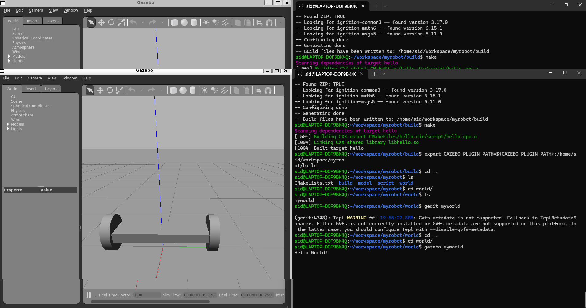

# Gazebo world
The purpose of this repository is to learn, how to build a two-wheeled robot model with the Model Editor tool in Gazebo. 
Include this model in an empty Gazebo World. And, finally write a plugin to interact with this world.

## Description

Overview of [Gazebo](https://gazebosim.org/home) through a two-wheeled robot model creation.

## Getting Started

### Directory structure
    .myrobot                           # myrobot lab main folder 
    ├── images                         # Code output image                   
    │   ├── output.png
    ├── model                          # Model files of the two-wheeled robot
    │   ├── robot
    │   │   ├── model.config
    │   │   ├── model.sdf
    ├── script                         # Gazebo World plugin C++ script      
    │   ├── hello.cpp
    ├── world                          # Gazebo main World empty scene
    │   ├── myworld
    ├── CMakeLists.txt                 # Link libraries 
    └──                              

### Dependencies

* Operating System — Ubuntu Bionic 18.04 LTS or 20.04 LTS (Focal Fossa), and WSL on Windows
* Software packages — CMake 2.8 or later, ROS Noetic, Gazebo 11
    * [Gazebo Classic 11.0](https://classic.gazebosim.org/) will reach its end of life by Feb 2025.
    * [ROS Noetic](https://wiki.ros.org/noetic) is supported for 20.04 and will reach its end of life in May 2025.

### Installing

* [Install ROS Noetic using Ubuntu/WSL](https://wiki.ros.org/noetic/Installation/Ubuntu)
* [Install Gazebo using Ubuntu packages](https://classic.gazebosim.org/tutorials?tut=install_ubuntu)
* [Install ROS Noetic using Robostack for Mac](https://robostack.github.io/GettingStarted.html)
* [Install Gazebo on Mac](https://classic.gazebosim.org/tutorials?tut=install_on_mac&cat=install)
* To verify installation, run
```
gazebo
```

### How to run

* How to run the program

    * Update and upgrade the Workspace
    ```
    sudo apt-get update
    ```
    * Clone the lab folder in /home/workspace/
    ```
    cd /home/workspace/
    git clone https://github.com/udacity/RoboND-myrobot myrobot
    ```
    * Compile code
    ```
    mkdir build
    cd build/
    cmake ../
    make # You might get errors if your system is not up to date!
    ```
    * Add the library path to the Gazebo plugin path
    ```
    export GAZEBO_PLUGIN_PATH=${GAZEBO_PLUGIN_PATH}:/home/workspace/myrobot/build
    ```
    * Run Gazebo world
    ```
    cd /home/workspace/myrobot/world/
    gazebo myworld
    ```

## Visualize output

A ```Hello World!``` message is printed in the terminal. This message interacts with the Gazebo World that includes the two-wheeled robot.



## Reference repository

[RoboND-myrobot](https://github.com/udacity/RoboND-myrobot)